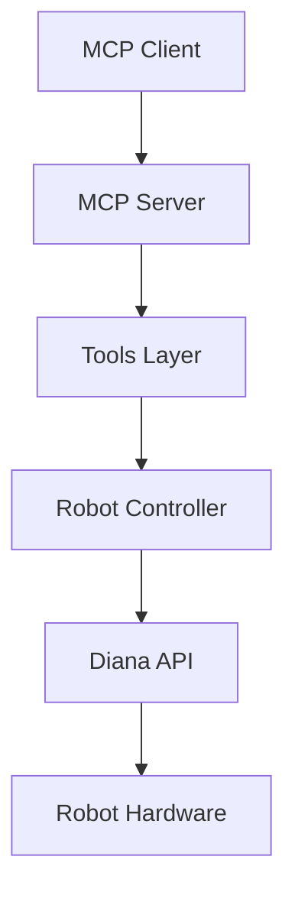

# 项目改进建议

> 针对大三学生水平的代码质量提升建议

## 📋 目录
1. [代码质量](#代码质量)
2. [测试覆盖](#测试覆盖)
3. [文档完善](#文档完善)
4. [开发工具配置](#开发工具配置)
5. [项目结构优化](#项目结构优化)
6. [安全性增强](#安全性增强)
7. [性能优化](#性能优化)
8. [CI/CD 集成](#cicd-集成)

---

## 1. 代码质量

### 1.1 代码风格统一
**问题**: 缺少代码格式化工具配置
**建议**:
- 添加 `pyproject.toml` 配置 Black、isort、flake8
- 统一代码风格，提高可读性

**实施步骤**:
```bash
# 创建 pyproject.toml
cat > pyproject.toml << 'EOF'
[tool.black]
line-length = 100
target-version = ['py38', 'py39', 'py310', 'py311']
include = '\.pyi?$'

[tool.isort]
profile = "black"
line_length = 100

[tool.flake8]
max-line-length = 100
exclude = [".git", "__pycache__", "build", "dist"]
EOF
```

### 1.2 类型注解完善
**问题**: 部分函数缺少完整的类型注解
**建议**:
- 为所有公共函数添加完整的类型注解
- 使用 `typing` 模块增强类型提示
- 考虑使用 `mypy` 进行类型检查

**示例改进** (`server/config.py`):
```python
# 当前
def get_net_info(ip: str) -> tuple:

# 改进
def get_net_info(ip: str) -> tuple[str, int, int, int, int, int]:
```

### 1.3 代码注释增强
**问题**: 部分复杂逻辑缺少详细注释
**建议**:
- 为复杂算法添加行内注释
- 使用 Google 或 NumPy 风格的文档字符串
- 添加模块级别的文档说明

**示例** (`server/utils.py` 的 `SuppressRobotOutput` 类):
```python
class SuppressRobotOutput:
    """临时抑制机械臂库的输出（包括C扩展直接写入文件描述符的输出）
    
    这个类通过文件描述符级别的重定向来捕获所有输出，包括：
    - Python 标准输出（sys.stdout）
    - Python 标准错误（sys.stderr）
    - C 扩展直接写入文件描述符的输出
    
    使用示例:
        with SuppressRobotOutput():
            robot_control.controller.move_joint_positions(...)
    """
```

---

## 2. 测试覆盖

### 2.1 单元测试扩展
**问题**: 测试覆盖不够全面，缺少边界情况测试
**建议**:
- 为每个验证器函数添加单元测试
- 测试边界值和异常情况
- 使用 `pytest.fixture` 减少重复代码

**创建文件**: `tests/test_validators.py`
```python
import pytest
from server.validators import (
    validate_joints, validate_pose, 
    validate_velocity, validate_acceleration
)

class TestValidateJoints:
    def test_valid_joints(self):
        """测试有效的关节值"""
        result = validate_joints([0.0, 0.1, 0.2, 0.3, 0.4, 0.5, 0.6])
        assert len(result) == 7
    
    def test_invalid_length(self):
        """测试无效长度的关节数组"""
        with pytest.raises(ValueError, match="必须是7个值"):
            validate_joints([0.0] * 6)
    
    def test_out_of_range(self):
        """测试超出范围的关节值"""
        with pytest.raises(ValueError):
            validate_joints([10.0] * 7)  # 超出 ±π 范围
```

### 2.2 集成测试
**问题**: 缺少端到端的集成测试
**建议**:
- 创建完整的操作流程测试
- 测试多个工具的组合使用
- 模拟真实使用场景

**创建文件**: `tests/test_integration.py`
```python
def test_complete_workflow():
    """测试完整的机械臂操作流程"""
    # 1. 连接
    # 2. 获取状态
    # 3. 执行运动
    # 4. 等待完成
    # 5. 断开连接
    pass
```

### 2.3 测试覆盖率报告
**建议**:
- 使用 `pytest-cov` 生成覆盖率报告
- 目标覆盖率: 80%+
- 在 CI 中集成覆盖率检查

```bash
pip install pytest-cov
pytest --cov=server --cov-report=html
```

---

## 3. 文档完善

### 3.1 API 文档
**问题**: 缺少自动生成的 API 文档
**建议**:
- 使用 Sphinx 或 MkDocs 生成文档
- 从代码注释自动生成 API 参考
- 添加使用示例和教程

**创建文件**: `docs/conf.py` (Sphinx 配置)

### 3.2 README 增强
**建议**:
- 添加架构图（使用 Mermaid）
- 添加快速开始指南
- 添加常见问题 (FAQ)
- 添加贡献指南 (CONTRIBUTING.md)

**示例架构图**:
```markdown
## 架构图


```

### 3.3 代码示例
**问题**: 示例代码可以更丰富
**建议**:
- 添加更多实际使用场景的示例
- 添加错误处理示例
- 添加最佳实践示例

**创建文件**: `examples/advanced_usage.py`

---

## 4. 开发工具配置

### 4.1 Pre-commit Hooks
**建议**: 添加 Git pre-commit 钩子，自动检查代码质量

**创建文件**: `.pre-commit-config.yaml`
```yaml
repos:
  - repo: https://github.com/psf/black
    rev: 23.12.1
    hooks:
      - id: black
  
  - repo: https://github.com/pycqa/isort
    rev: 5.13.2
    hooks:
      - id: isort
  
  - repo: https://github.com/pycqa/flake8
    rev: 7.0.0
    hooks:
      - id: flake8
```

**安装**:
```bash
pip install pre-commit
pre-commit install
```

### 4.2 开发依赖管理
**问题**: 缺少开发依赖的明确管理
**建议**:
- 在 `setup.py` 中添加 `extras_require` 用于开发依赖
- 或创建 `requirements-dev.txt`

**修改 `setup.py`**:
```python
setup(
    # ... 现有配置
    extras_require={
        'dev': [
            'pytest>=7.0.0',
            'pytest-cov>=4.0.0',
            'black>=23.0.0',
            'flake8>=6.0.0',
            'mypy>=1.0.0',
            'pre-commit>=3.0.0',
        ],
    },
)
```

### 4.3 编辑器配置
**建议**: 添加 `.editorconfig` 统一编辑器设置

**创建文件**: `.editorconfig`
```ini
root = true

[*]
charset = utf-8
end_of_line = lf
insert_final_newline = true
trim_trailing_whitespace = true

[*.py]
indent_style = space
indent_size = 4
max_line_length = 100
```

---

## 5. 项目结构优化

### 5.1 配置文件管理
**问题**: 硬编码的配置值
**建议**:
- 使用环境变量或配置文件
- 创建配置示例文件

**创建文件**: `config.example.yaml`
```yaml
robot:
  default_ip: "192.168.10.75"
  default_ports: [0, 0, 0, 0, 0]
  connection_timeout: 10

logging:
  level: "INFO"
  file: "var/mcp/audit.log"
  max_size: "10MB"
  backup_count: 5
```

### 5.2 日志系统增强
**问题**: 日志系统较简单，缺少日志级别和轮转
**建议**:
- 使用 `logging` 模块替代简单的文件写入
- 添加日志级别 (DEBUG, INFO, WARNING, ERROR)
- 实现日志轮转

**改进 `server/error_handler.py`**:
```python
import logging
from logging.handlers import RotatingFileHandler

def setup_logging():
    """配置日志系统"""
    logger = logging.getLogger('diana_mcp')
    logger.setLevel(logging.INFO)
    
    # 文件处理器（带轮转）
    file_handler = RotatingFileHandler(
        AUDIT_LOG, 
        maxBytes=10*1024*1024,  # 10MB
        backupCount=5
    )
    file_handler.setFormatter(
        logging.Formatter('%(asctime)s - %(levelname)s - %(message)s')
    )
    logger.addHandler(file_handler)
    
    return logger
```

### 5.3 版本管理
**建议**:
- 使用语义化版本控制
- 在代码中定义版本号
- 添加 `CHANGELOG.md`

**修改 `server/__init__.py`**:
```python
__version__ = "0.1.0"
__author__ = "Your Name"
```

---

## 6. 安全性增强

### 6.1 输入验证增强
**问题**: 部分输入验证可以更严格
**建议**:
- 添加 IP 地址格式验证（使用 `ipaddress` 模块）
- 添加参数范围检查
- 防止注入攻击

**改进 `server/utils.py`**:
```python
import ipaddress

def normalize_ip(ip: Optional[str]) -> Optional[str]:
    """规范化 IP 参数，处理字符串 "null" 和不完整的 IP"""
    if not ip or ip == "null" or ip == "None" or not ip.strip():
        return None
    
    # 使用标准库验证 IP
    try:
        ipaddress.ip_address(ip.strip())
        return ip.strip()
    except ValueError:
        return None
```

### 6.2 敏感信息保护
**问题**: 可能包含敏感配置
**建议**:
- 确保 `.env` 文件在 `.gitignore` 中（已包含 ✓）
- 不要硬编码密码或密钥
- 使用环境变量管理敏感配置

---

## 7. 性能优化

### 7.1 连接池管理
**建议**: 如果未来需要支持多机器人，考虑连接池

### 7.2 异步操作优化
**问题**: 部分操作可以更好地利用异步
**建议**:
- 检查是否有可以并行执行的操作
- 优化等待任务完成的逻辑

### 7.3 缓存机制
**建议**: 对于频繁查询的状态信息，考虑添加缓存

**示例**:
```python
from functools import lru_cache
from time import time

@lru_cache(maxsize=1)
def get_cached_robot_state(ip: str, cache_time: float):
    """带缓存的机器人状态查询"""
    return robot_control.controller.get_robot_state()
```

---

## 8. CI/CD 集成

### 8.1 GitHub Actions
**建议**: 添加 GitHub Actions 工作流

**创建文件**: `.github/workflows/ci.yml`
```yaml
name: CI

on: [push, pull_request]

jobs:
  test:
    runs-on: ubuntu-latest
    steps:
      - uses: actions/checkout@v3
      - uses: actions/setup-python@v4
        with:
          python-version: '3.11'
      - name: Install dependencies
        run: |
          pip install -e .
          pip install pytest pytest-cov
      - name: Run tests
        run: |
          pytest --cov=server --cov-report=xml
      - name: Upload coverage
        uses: codecov/codecov-action@v3
```

### 8.2 代码质量检查
**建议**: 在 CI 中集成代码质量检查

```yaml
- name: Code quality
  run: |
    black --check .
    flake8 .
    mypy server/
```

---

## 9. 其他改进建议

### 9.1 错误处理改进
**建议**:
- 创建更详细的错误类型层次结构
- 提供更友好的错误消息
- 添加错误恢复机制

### 9.2 监控和指标
**建议**:
- 添加操作统计（成功/失败次数）
- 记录操作耗时
- 添加健康检查端点

### 9.3 国际化支持
**建议**: 如果未来需要，考虑使用 `gettext` 支持多语言

---

## 优先级建议

### 🔴 高优先级（立即实施）
1. 添加代码格式化工具（Black, isort）
2. 完善类型注解
3. 扩展单元测试覆盖
4. 改进日志系统

### 🟡 中优先级（近期实施）
1. 添加 Pre-commit hooks
2. 完善文档（API 文档、架构图）
3. 添加 CI/CD 配置
4. 增强输入验证

### 🟢 低优先级（长期规划）
1. 性能优化
2. 监控和指标
3. 国际化支持

---

## 学习资源

作为大三学生，建议学习以下内容来提升项目质量：

1. **Python 最佳实践**
   - 《Effective Python》- Brett Slatkin
   - PEP 8 风格指南

2. **测试驱动开发**
   - pytest 官方文档
   - 《Test-Driven Development with Python》

3. **软件工程**
   - 设计模式
   - 代码重构技巧
   - 版本控制最佳实践

4. **工具使用**
   - Git 高级用法
   - CI/CD 概念和实践
   - 代码质量工具

---

## 总结

这个项目已经展现了良好的代码组织能力和工程思维。通过实施以上建议，可以进一步提升代码质量、可维护性和专业性。建议按照优先级逐步实施，不要一次性改动太多。

**当前项目优点**:
- ✅ 清晰的模块划分
- ✅ 统一的错误处理模式
- ✅ 良好的类型注解基础
- ✅ 实用的测试代码

**需要改进的地方**:
- ⚠️ 代码风格统一
- ⚠️ 测试覆盖率
- ⚠️ 文档完善
- ⚠️ 开发工具配置

继续保持！🚀

